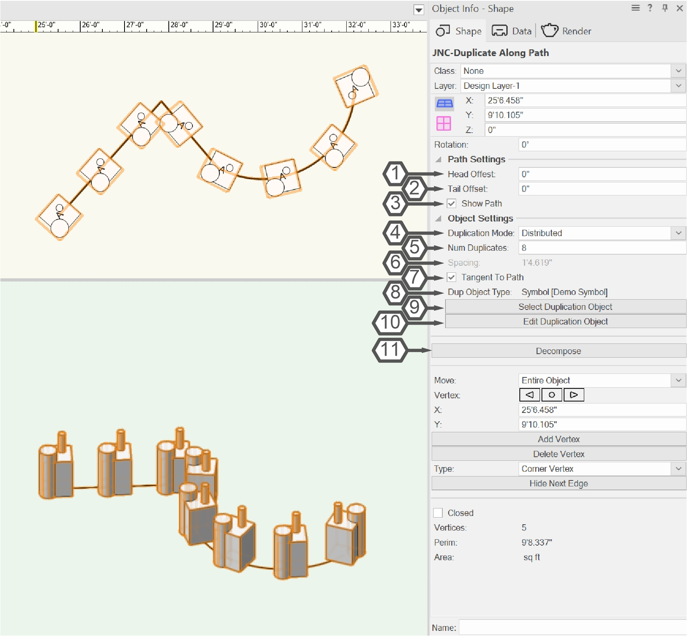
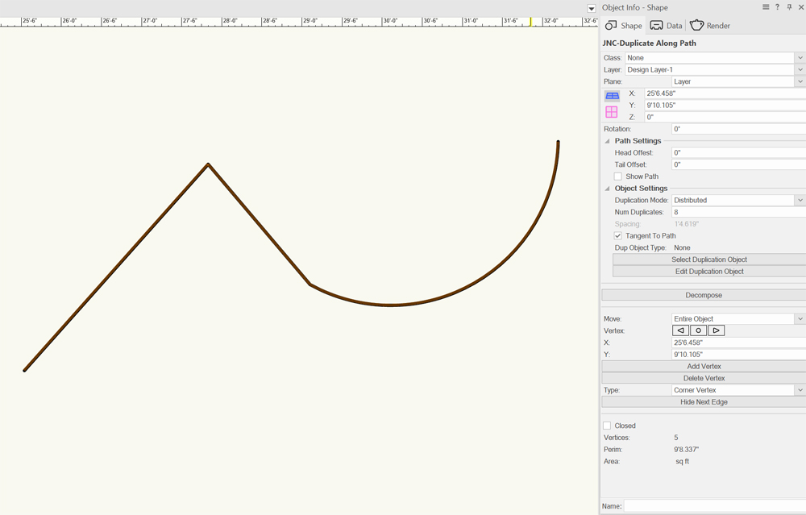
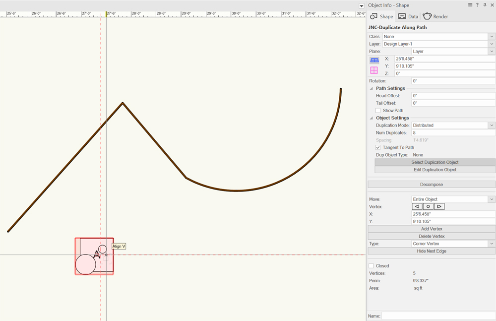
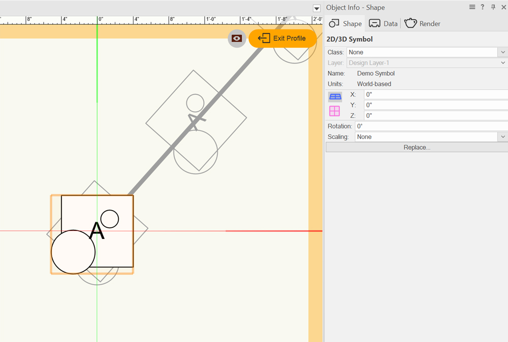
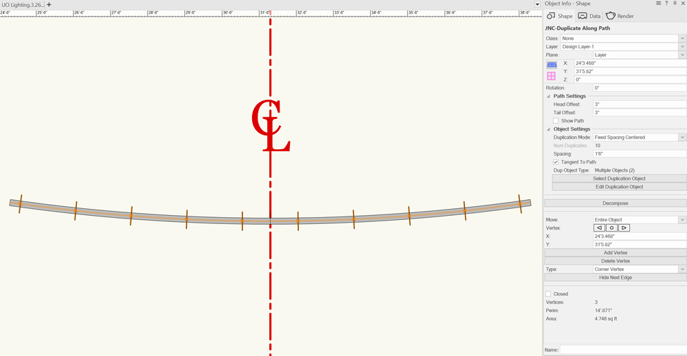

# JNC-Duplicate Along Path

2D Path Plug-in Object

## Icon

## Version

**1.0.0** - 8/16/2026

This plug-in is written in Vectorscript (Pascal) and can be used in any version of [Vectorworks](https://www.vectorworks.net) 2019 or newer.

## Description

This plug-in object allows the user to create a parametric version of the Duplicate Along Path menu command. This allows the duplication process to be more interactive and iterative, with the ability to change the path shape, duplication objects, number of duplicates, and spacing on the fly. Once satisfied, the user can "decompose" the plug-in object into a Group.

The plug-in uses the **Profile Group** to determine what to duplicate.

## Instructions

1. Activate the **JNC-Duplicate Along Path** tool.
1. Draw the desired path, double-click when finished.
1. Add objects to duplicate into the PIO using the methods listed [below](#methods-of-creating-duplicates).
1. Set the duplication and spacing parameters in the Object Info Palette.
1. Edit the path as necessary using the VW **Reshape Tool**.
1. Edit the duplication objects by either pressing the **Edit Duplication Object** button in the Object Info Palette or by double-clicking the **JNC-Duplicate Along Path** object. This will open Profile Group in the editor.
1. Once satisfied with the duplication, press the **Decompose** button to create a Group with the duplicated objects in place of the selected **JNC-Duplicate Along Path** object.

## Object Info Palette Parameters

1. **Head Offset**: This dimension value offsets the starting point of duplication along the path. A positive value decreases the size of the path, a negative value increases the size of the duplication path.
1. **Tail Offset**: This dimension value offsets the ending point of duplication along the path. A positive value decreases the size of the duplication path, a negative value increases the size of the duplication path.
1. **Show Path**: Check this to make the path visible, matching attributes to the master PIO. When unchecked, the path is only visible when the PIO is selected or if the Profile Group is empty.
1. **Duplication Mode**: This drop-down determines the handling of number of duplicates vs. spacing of duplicates. There are 3 modes:
    - **Distributed**: Objects will be evenly distributed along the path, with an object placed at both the start and end of the path.
    - **Fixed Spacing**: Objects will be placed with the spacing entered, with an object placed at the start of the path and as many duplicates as can fit on the path.
    -  **Fixed Spacing Centered**: Similar to **Fixed Spacing** except the overall group of objects will be centered on the path, with an equal amount of empty space at the start and end of the path.
1. **Num Duplicates**: This number value determines how many duplicates to create. This parameter is only active in the **Distributed** mode.
1. **Spacing**: This dimension value determines the distance between duplicated objects. This parameter is only active in the **Fixed Spacing** and **Fixed Spacing Centered** modes.
1. **Tangent to Path**: Check this to rotate duplicated objects to match the angle of the path where the object is placed.
1. **Dup Object Type**: This static field reports on the contents of the profile group. Examples include:
    - **None**: No objects are currently in the Profile Group, so there is nothing to duplicate.
    - **PIO [*Name of plug-in object*]**
    - **Symbol [*Name of Symbol*]**
    - **Group**
    - **VW Primitive**: Objects such as rectangles, text, circles, etc. Basically anything not listed above.
    - **Multiple Objects (*number of objects*)**: Any time there are more than one objects in the Profile Group.
1. **Select Duplication Object** Button: Press this button to enter a mode to select an object to add to the Profile Group. Please note, selecting an object will not *replace* an existing duplication object, the selected object will be *added* to the Profile Group.
1. **Edit Duplication Object** Button: Press this button to enter into the edit mode for the selected **JNC-Duplicate Along Path** object's Profile Group.
1. **Decompose** Button: Press this button to delete the selected **JNC-Distribute Along Path** object and replace it with a Group containing the duplicated objects.

## Additional Information

### Methods of Creating Duplicates

When you first create the path object, the Profile Group will be empty so only the path will be created. Please note that even with the **Show Path** parameter unchecked, the path will be visible.

From here, two options are available for selecting objects to duplicate:

#### 1. Press the **Select Duplication Object** Button

Pressing the **Select Duplication Object** will enter into a "*Track Object*" mode, where viable objects will outline in red when hovered over. Left-click on an object to add it to the Profile Group. This will leave the selected object in place.

#### 2. Double-click the Object or Press the **Edit Duplication Object** Button

Either double-clicking the **JNC-Duplicate Along Path** object or pressing the **Edit Duplication Object** will enter into the edit container for the selected object's Profile Group.  From here, you can draw objects directly or place Symbols and other Plug-in Objects.

As many objects as you would like to duplicate can be added here. Please note that their location on the path will be determined by the objects' position in relation to the 0,0 origin of the Profile Group.

Press the **Exit Profile** button in the upper left hand corner to close the edit container and return to drawing space.

### Fixed Spacing Centered Mode Example

In American theater, it's very common to hang lighting fixtures on 1'6" centers, as that is as close as fixtures can be and still be focused comfortably. As a result, many lighting plots use a combination of Locus points and "tick marks" along hanging positions showing 1'6" spacing.  It's also fairly common to center the spacing of these marks on the center line of the theater, and to give 3" of extra spacing at the start and end of the pipe to allow proper clamp spacing.

This can easily and quickly be mocked up even on a curved pipe using the **Fixed Spacing Centered** mode and using the **Head Offset** and **Tail Offset** parameters to add in the padding.

## Installation Instructions

There are two methods of installation, direct download of the plug-in or through the **JNC Tools Free Manager** plug-in.

### Direct Download:

1. Download [source plug-in file](JNC-Duplicate%20Along%20Path.vso)
2. Place downloaded file inside the **Vectorworks User Folder** within the **Plug-ins** directory
3. Restart Vectorworks

### JNC Tools Free Manager

1. Run the [**JNC Tools Free Manager**](https://jncogs.github.io/JNC-Tools-Manager-Free/) menu command
2. Select the **JNC-Duplicate Along Path** tool
3. Press the **Install / Update** button
4. Press **Close** to close the dialog box
5. Restart Vectorworks

## Adding the Plug-in to your Workspace

1. Open the **Workspace Editor** by going to **Tools - Workspaces - Edit Current Workspace**
2. Select the **Menus** tab
3. In the box on the left, find and expand the **JNC** category
4. In the box on the right, find a suitable tool set to place the tool in, such as **Basic** or **Dims / Notes**
5. Click and drag the **JNC-Duplicate Along Path** tool from the box on the left to the desired tool set in the box on the right
6. Click **OK** to close the editor

## Localization Instructions

The plug-in can be localized to your native language without having access to the source code.  This can be achieved by following the instructions below:

1. Open the **Plug-in Manager** by going to **Tools - Plug-ins - Plug-in Manager**
2. Select the **Third-party Plug-ins** tab
3. Select the **JNC-Duplicate Along Path** tool
4. Click the **Customize** button
5. Select the **Strings** tab
6. Double-click a category, such as **Dialog Strings**
7. Select a string to edit and press the **Edit** button
8. Write a new string and press the **OK** button until you are back to the **Plug-in Manager**

The categories for this plug-in are as follows:

- **3000** - *Record Strings*: These strings are used to reference the parametric record of the **JNC-Duplicate Along Path** object and should not be changed.
- **4000** - *Object Types*: These strings are all used to populate the **Dup Object Type** field and can all freely be changed.

## Release Notes

| Date | Version | Note |
| :---: | :---: | :--- |
| 08/16/2026 | 1.0.0 | Initial release |

## Known Bugs

No Known Bugs

## Feature Requests

No current Feature Requests

## License

Copyright (c) Jesse Cogswell (JNC Tools)

Permission is hereby granted, free of charge, to any person or organization
obtaining a copy of this software (the "User") and associated documentation files (the "Software"),
to use, reproduce, distribute, execute, and transmit the Software.

The User is not permitted to modify or attempt to reverse engineer the source code.  The User may
localize the Software using approved methods from within the Vectorworks software.

THE SOFTWARE IS PROVIDED "AS IS", WITHOUT WARRANTY OF ANY KIND, EXPRESS OR
IMPLIED, INCLUDING BUT NOT LIMITED TO THE WARRANTIES OF MERCHANTABILITY,
FITNESS FOR A PARTICULAR PURPOSE, TITLE AND NON-INFRINGEMENT. IN NO EVENT
SHALL THE COPYRIGHT HOLDERS OR ANYONE DISTRIBUTING THE SOFTWARE BE LIABLE
FOR ANY DAMAGES OR OTHER LIABILITY, WHETHER IN CONTRACT, TORT OR OTHERWISE,
ARISING FROM, OUT OF OR IN CONNECTION WITH THE SOFTWARE OR THE USE OR OTHER
DEALINGS IN THE SOFTWARE.